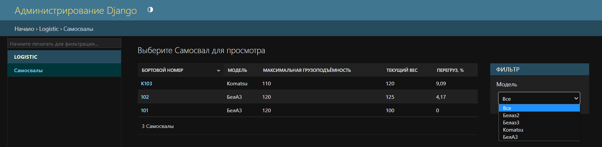

# Test project in django.

To start the project you need:

1) git clone https://github.com/MaximF39/DjangoTipper.git
2) cd app
3) python manage.py migrate
4) python manage.py runserver

Users:

1. root 123 (username, password) - superuser

Apps:

1. logistic

3rd-parties:

1. django_admin_listfilter_dropdown 
2. public_admin (view ModelAdmin)

Link for view model admin:  
http://127.0.0.1:8000/logistic/view/logistic/tipper

# Example

TripperModel

Tripper

TripperModel

